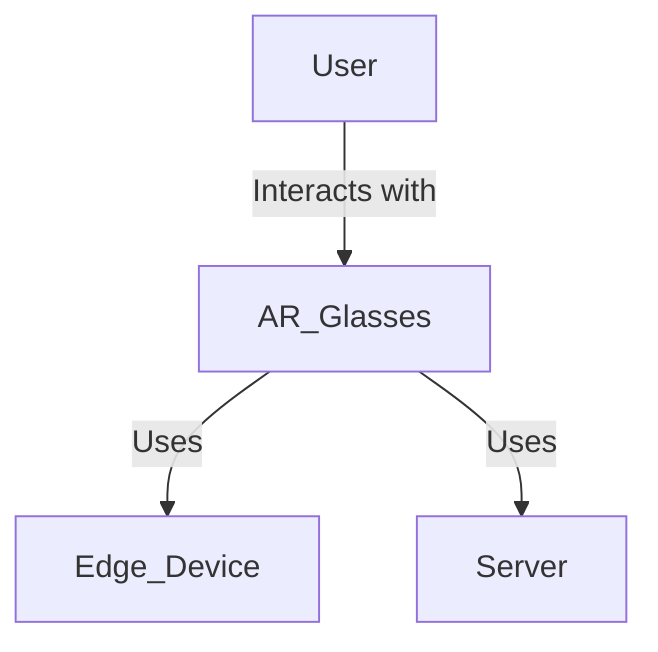
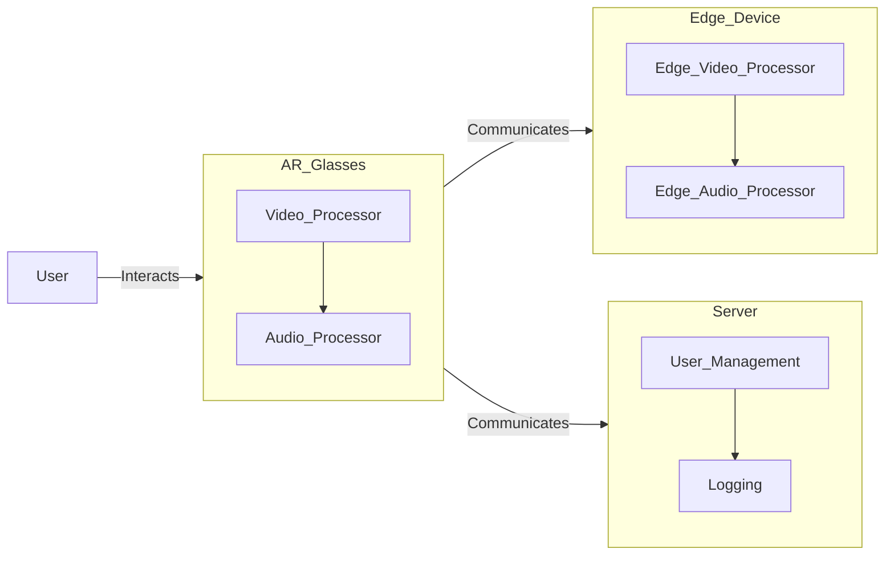
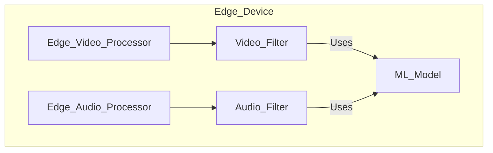
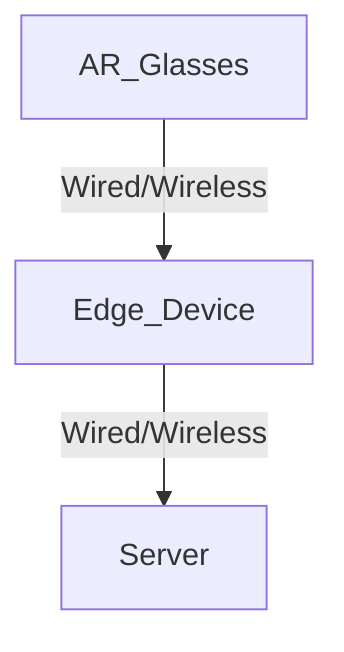

# Software Architecture Document

## 1. Introduction
The AR-Glasses application aims to provide an augmented reality experience by filtering external visual and audio stimuli based on a predefined list of allowed people. The application serves as an aid for children and adults with autism or other sensory sensitivities, offering a controlled environment.

## 2. Architectural Goals and Constraints
### Goals
1. Transform the video stream from AR glasses by filtering out people not in the allowed list.
2. Filter the audio stream to exclude voices of unauthorized individuals.
3. Synchronize the modified audio and video streams.
4. Provide a cross-platform application optimized for Pico 4 and Meta Quest 3 glasses.
5. Ensure reliable operation in various environmental conditions.

### Constraints
1. Latency between input and output streams must not exceed 100ms.
2. Allow computationally expensive operations on an edge device.
3. Application should support multi-tenancy.

## 3. Architectural Vision
### C4 Model Diagrams

#### Context Diagram

**Description:** The Context Diagram shows how the system (AR Glasses) interacts with an edge device and a central server.

#### Container Diagram

**Description:** The Container Diagram shows how the system is broken down into different containers (e.g., AR Glasses, Edge Device, Server), illustrating their responsibilities and interactions.

#### Component Diagram (Edge Device)

**Description:** The Component Diagram details the processing components within the Edge Device, focusing on filtering video and audio using pre-trained machine learning models.

## 4. Technology Stack
1. **AR Glasses:** Uses embedded processors for video and audio processing.
2. **Edge Device:** Optimized for high-performance computing to handle intensive filtering operations.
3. **Server:** Manages user accounts, configuration, and logging.
4. **Programming Languages:** C++ (performance-critical tasks), Python (ML processing).
5. **Frameworks/Tools:** OpenCV (image processing), TensorFlow (ML models).

## 5. Security and Performance Considerations
- **Security:** Ensure user data privacy through encryption. Access controls and authentication mechanisms to prevent unauthorized usage.
- **Performance:** Keep latency under 100ms. Optimize network communication between AR glasses, edge device, and server.

## 6. Quality Attributes
1. **Scalability:** Multi-tenancy architecture for different customer types.
2. **Reliability:** Operates effectively in public environments.
3. **Maintainability:** Modular architecture, allowing for independent updates to containers.

## 7. Deployment Diagram

**Description:** The Deployment Diagram shows the network interactions between the AR Glasses, the edge device, and the central server.
